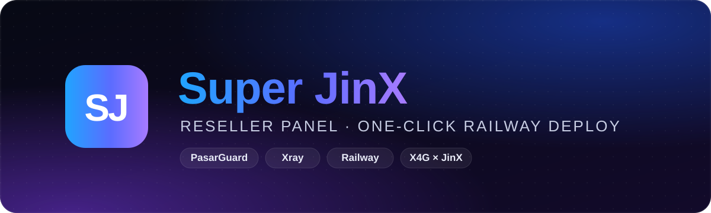
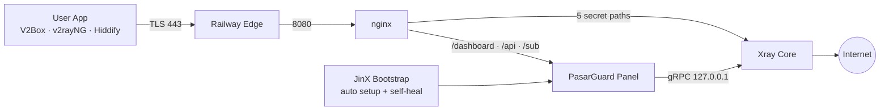

<div align="center">



<br>

<h1>Super JinX Panel</h1>

<p><b>پنل نمایندگی حرفه‌ای، رایگان و متن‌باز بر پایه‌ی PasarGuard</b><br>
یک کلیک تا یک سرویس کامل: پنل، هسته‌ی Xray و ۵ کانفیگ آماده، همه روی Railway</p>

<a href="https://t.me/+WvKFv0lU_i5lNGE0"></a>


<br>


<br><br>

<a href="#install"><b>نصب</b></a> &nbsp;·&nbsp;
<a href="#features"><b>امکانات</b></a> &nbsp;·&nbsp;
<a href="#configs"><b>کانفیگ‌ها</b></a> &nbsp;·&nbsp;
<a href="#reseller"><b>نمایندگی</b></a> &nbsp;·&nbsp;
<a href="#docs"><b>مستندات</b></a> &nbsp;·&nbsp;
<a href="https://t.me/+WvKFv0lU_i5lNGE0"><b>کانال</b></a>

</div>

<br>

<div dir="rtl">

> [!NOTE]
> **Super JinX** کاملاً رایگانه. ریپو رو Fork کن، روی Railway بساز و در کمتر از ۵ دقیقه پنل نمایندگی خودت رو تحویل بگیر. بدون VPS، بدون ترمینال، بدون تنظیم دستی.

<br>

## فهرست مطالب

| | | |
|---|---|---|
| [معرفی](#intro) | [امکانات](#features) | [معماری](#arch) |
| [نصب](#install) | [ورود و امنیت](#login) | [کلید مالک](#owner-key) |
| [گروه‌ها و کانفیگ‌ها](#configs) | [اپ‌های پشتیبانی‌شده](#apps) | [پنل نمایندگی](#reseller) |
| [صفحه‌ی اشتراک](#sub) | [خودترمیمی](#heal) | [سرعت و پینگ](#speed) |
| [متغیرها](#vars) | [آپدیت](#update) | [عیب‌یابی سریع](#fix) |
| [مستندات](#docs) | [همکاری](#collab) | [پشتیبانی](#support) |

<br>

<a id="intro"></a>
##  &nbsp;معرفی

**Super JinX** یک پنل نمایندگی کامل و آماده‌ی فروشه که روی [PasarGuard](https://github.com/PasarGuard/panel) ساخته شده. پنل، هسته‌ی Xray و وب‌سرور همه داخل **یک سرویس** روی Railway اجرا میشن و همه‌ی تنظیمات، از اینباندها و هاست‌ها تا گروه‌ها، قالب‌های فروش و نقش نماینده، **خودکار** انجام میشه.

کافیه ریپو رو Fork کنی و به Railway وصلش کنی. چند دقیقه بعد یک پنل فارسی با دو گروه کانفیگ، صفحه‌ی اشتراک اختصاصی و سیستم نمایندگی آماده داری.

<br>

<a id="features"></a>
##  &nbsp;امکانات

<table>
<tr>
<td width="50%" valign="top">

###  &nbsp;نصب بدون دردسر
- Fork و Deploy، بدون ویرایش حتی یک فایل
- پنل، هسته‌ی Xray و nginx در **یک سرویس**
- بدون نیاز به VPS یا نصب نود جداگانه
- همه چیز روی پورت `8080`

</td>
<td width="50%" valign="top">

###  &nbsp;کانفیگ‌های حرفه‌ای
- **۵ کانفیگ** با ۳ پروتکل: VLESS، Trojan و VMess
- دو نوع انتقال: WebSocket و HTTPUpgrade
- TLS روی پورت 443 با `alpn=http/1.1`
- Early Data (`ed=2560`) برای پینگ کمتر

</td>
</tr>
<tr>
<td valign="top">

###  &nbsp;سیستم نمایندگی
- نقش آماده‌ی **«نماینده»** با سهمیه‌ی حجم
- هر نماینده فقط کاربرهای خودش رو می‌بینه
- ۱۰ قالب فروش آماده برای هر دو گروه
- منوی تمیز و ساده برای نماینده‌ها

</td>
<td valign="top">

###  &nbsp;صفحه‌ی اشتراک اختصاصی
- طراحی شیشه‌ای تیره با حلقه‌ی مصرف
- پینگ زنده‌ی سرور و تاریخ شمسی
- **QR داخلی** با ذخیره‌ی تصویر
- اتصال با یک لمس به ۶ اپ محبوب

</td>
</tr>
<tr>
<td valign="top">

###  &nbsp;خودترمیمی و پایداری
- ری‌استارت خودکار هسته در صورت قطعی
- نگهبان سرویس با بازگشت خودکار
- اصلاح خودکار تنظیمات به‌هم‌ریخته
- بدون ذخیره‌سازی‌های بی‌دلیل و قطعی‌های کوتاه

</td>
<td valign="top">

###  &nbsp;امنیت
- مسیرهای کانفیگ **اختصاصی برای هر نصب**
- همه‌ی پورت‌های داخلی فقط روی `127.0.0.1`
- کلید ۵ دقیقه‌ای مالک با محافظت در برابر حدس رمز
- رمز مالک فقط دست خودته و هیچ وقت خودکار عوض نمیشه

</td>
</tr>
</table>

<br>

<a id="arch"></a>
##  &nbsp;معماری

</div>



<div dir="rtl">

<br>

<a id="install"></a>
##  &nbsp;نصب

> [!TIP]
> زمان نصب حدود **۵ دقیقه**ست. فقط یک اکانت [GitHub](https://github.com) و یک اکانت [Railway](https://railway.com) لازم داری.

**مرحله‌ی ۱: Fork**

بالای همین صفحه روی **Fork** بزن تا یک نسخه از ریپو در اکانت خودت ساخته بشه.

**مرحله‌ی ۲: Deploy روی Railway**

| | کار | مسیر در Railway |
|:---:|---|---|
| ۱ | ساخت پروژه از ریپوی خودت | **New Project ← Deploy from GitHub repo** |
| ۲ | اتصال Volume با مسیر `/var/lib/pasarguard` | **راست‌کلیک روی سرویس ← Attach Volume** |
| ۳ | ساخت دامنه با پورت `8080` | **Settings ← Networking ← Generate Domain** |
| ۴ | انتخاب نزدیک‌ترین Region به ایران | **Settings ← Deploy ← Region ← EU West (Amsterdam)** |
| ۵ | یک بار اجرای دوباره | **Deployments ← Redeploy** |

**مرحله‌ی ۳: تمام**

توی **Deploy Logs** این خط یعنی پنل آماده‌ست:

</div>

```text
[bootstrap] DONE -> https://YOUR-DOMAIN/dashboard/
```

<div dir="rtl">

> [!IMPORTANT]
> بدون **Volume** با هر ری‌استارت همه‌ی کاربرها و تنظیمات پاک میشن. مرحله‌ی ۲ رو جا نندازید.

> [!NOTE]
> **هر نصب، مسیرهای اختصاصی خودش رو داره.** موقع اولین اجرا مسیر هر ۵ کانفیگ به‌صورت تصادفی ساخته و روی Volume نگه داشته میشه. هر Fork روی سرور جداگانه‌ی خودش اجرا میشه، پس پنل‌ها هیچ منبعی رو با هم شریک نیستن و از سرعت هم کم نمی‌کنن.

<br>

<a id="login"></a>
##  &nbsp;ورود و امنیت

| نقش | آدرس | نام کاربری | رمز |
|---|---|---|---|
| **مالک** | `https://YOUR-DOMAIN/dashboard/` | `admin` | `admin` |
| **نماینده‌ی نمونه** (۵۰ گیگ) | `https://YOUR-DOMAIN/dashboard/` | `reseller` | `reseller` |

> [!WARNING]
> `admin` / `admin` فقط برای **اولین ورود** هست. همون اول رمز مالک رو عوض کن و رمز نماینده‌ی نمونه رو هم تغییر بده یا پاکش کن (دیگه ساخته نمیشه). رمزی که خودت بذاری هیچ وقت خودکار عوض نمیشه.

<a id="owner-key"></a>
###  &nbsp;تغییر رمز با کلید ۵ دقیقه‌ای مالک

1. توی پنل برو **«کلیدهای API»**. بالای صفحه بخش **«کلید ۵ دقیقه‌ای مالک»** هست، روی **«دریافت کلید»** بزن.
2. توی صفحه‌ی ورود روی **«دسترسی مالک»** بزن، کلید رو وارد کن و رمز جدید بذار.
3. با رمز جدید وارد پنل شو.

رمز یادت رفته؟ سرویس رو توی Railway **Restart** کن و کلید رو از خط **`OWNER KEY`** توی لاگ بردار.

<br>

<a id="configs"></a>
##  &nbsp;گروه‌ها و کانفیگ‌ها

دو گروه آماده داری و موقع ساخت هر کاربر، گروهش رو خودت انتخاب می‌کنی:

| گروه | کانفیگ | پروتکل | انتقال | اثرانگشت TLS | ویژگی |
|---|---|---|---|---|---|
| **جینکس پرو** | 𝗣𝗿𝗼 | VLESS | WebSocket + Early Data | Chrome | تک‌کانفیگ با کمترین پینگ |
| **𝗝𝗶𝗻𝗫** | ⚡ 𝗙𝗹𝗮𝘀𝗵 | VLESS | WebSocket | Firefox | سریع و سبک |
| | 🔥 𝗙𝗶𝗿𝗲 | Trojan | WebSocket | Safari | مناسب iOS |
| | 💎 𝗗𝗶𝗮𝗺𝗼𝗻𝗱 | VMess | WebSocket | Edge | سازگاری با اپ‌های قدیمی |
| | 🌙 𝗡𝗶𝗴𝗵𝘁 | VLESS | HTTPUpgrade | iOS | پایدار در شبکه‌های سخت |

اسم هر کانفیگ توی اپ کاربر اینجوری دیده میشه: `𝗣𝗿𝗼 | جینکس | 𝙎𝙪𝙥𝙚𝙧 𝗝𝗶𝗻𝗫`

> [!TIP]
> اگه موقع ساخت کاربر گروهی انتخاب نکنی، پنل خودکار اون رو به گروه **𝗝𝗶𝗻𝗫** وصل می‌کنه.

**لینک اشتراک**

</div>

```text
https://YOUR-DOMAIN/sub/<token>
```

<div dir="rtl">

<a id="apps"></a>
###  &nbsp;اپ‌های پشتیبانی‌شده

| اپ | Android | iOS | Windows | اتصال با یک لمس |
|---|:---:|:---:|:---:|:---:|
| **V2Box** | ✓ | ✓ | | ✓ |
| **v2rayNG** | ✓ | | | ✓ |
| **Hiddify** | ✓ | ✓ | ✓ | ✓ |
| **Streisand** | | ✓ | | ✓ |
| **Happ** | ✓ | ✓ | ✓ | ✓ |
| **NekoBox** | ✓ | | ✓ | ✓ |
| **Clash Meta / sing-box** | ✓ | ✓ | ✓ | |

<br>

<a id="reseller"></a>
##  &nbsp;پنل نمایندگی

**ساخت نماینده**
1. با اکانت مالک وارد شو و برو **مدیران ← افزودن مدیر**. منوی «مدیران» فقط برای مالک دیده میشه.
2. نقش رو **«نماینده»** بذار و سهمیه‌ی حجم رو مشخص کن (مثلاً **50 GB**).
3. ذخیره کن و یوزر و رمز رو به نماینده بده.

**ساخت کاربر**
**کاربران ← ساخت کاربر**، یک قالب انتخاب کن و ذخیره کن. قالب‌های Pro به گروه **جینکس پرو** و بقیه به گروه **𝗝𝗶𝗻𝗫** وصل میشن.

**قالب‌های فروش آماده**

| گروه | قالب‌ها |
|---|---|
| **𝗝𝗶𝗻𝗫** | 10، 30، 50 و 100 گیگ (۳۰ روزه) · 200 گیگ (۶۰ روزه) · نامحدود (۳۰ روزه) |
| **جینکس پرو** | Pro 30، 50 و 100 گیگ · Pro نامحدود (همه ۳۰ روزه) |

**منوی پنل**: داشبورد · کاربران · کلیدهای API · قالب‌ها · عملیات گروهی · تنظیمات · پشتیبانی

<br>

<a id="sub"></a>
##  &nbsp;صفحه‌ی اشتراک

صفحه‌ای که کاربر با باز کردن لینک اشتراک می‌بینه، مخصوص Super JinX طراحی شده:

- حلقه‌ی مصرف با حجم مصرف‌شده، باقی‌مانده و روزهای باقی‌مانده
- تاریخ انقضا به **تقویم شمسی** و هشدار نزدیک شدن به پایان
- **پینگ زنده‌ی سرور** با برچسب کیفیت
- اتصال با یک لمس به V2Box، v2rayNG، Hiddify، Streisand، Happ و NekoBox
- فهرست کانفیگ‌ها با برچسب پروتکل، **QR داخلی** و کپی سریع
- بدون نیاز به هیچ سرویس بیرونی برای QR

<br>

<a id="heal"></a>
##  &nbsp;خودترمیمی

| مشکل | واکنش خودکار پنل |
|---|---|
| قطع شدن هسته‌ی Xray | ری‌استارت خودکار هسته و اتصال دوباره‌ی نود |
| جواب ندادن پنل یا nginx به مدت ۳ دقیقه | ری‌استارت کامل سرویس |
| خطا در اسکریپت راه‌اندازی | اجرای دوباره‌ی خودکار بعد از ۱۰ ثانیه |
| تغییر یا حذف اشتباهی گروه‌ها و هاست‌ها | بررسی هر ۱۰ دقیقه و اصلاح خودکار |
| ساخت کاربر بدون گروه | اتصال خودکار به گروه 𝗝𝗶𝗻𝗫 |

پنل فقط وقتی چیزی رو دوباره ذخیره می‌کنه که **واقعاً** تغییر کرده باشه، پس اتصال کاربرها بی‌دلیل قطع نمیشه.

<br>

<a id="speed"></a>
##  &nbsp;سرعت و پینگ

- **Region**: سرویس رو روی **EU West (Amsterdam)** بذار، بهترین مسیر برای ایران.
- **Early Data**: یک رفت‌وبرگشت کمتر در هر اتصال.
- **پینگ واقعی در V2Box**: حدود ۱۵۰ تا ۲۵۰ میلی‌ثانیه روی اینترنت خوب و ۲۵۰ تا ۴۰۰ روی اینترنت همراه. عدد دقیق به اپراتور و مسیر کاربر بستگی داره.
- برای تست پینگ توی V2Box از **Real Delay / URL Test** استفاده کن.

<br>

<a id="vars"></a>
##  &nbsp;متغیرهای اختیاری

هیچ متغیری الزامی نیست. اگه خواستی، از **Variables** سرویس در Railway اضافه‌شون کن:

| متغیر | پیش‌فرض | کاربرد |
|---|---|---|
| `CONFIG_TITLE` | `جینکس \| 𝙎𝙪𝙥𝙚𝙧 𝗝𝗶𝗻𝗫` | متنی که بعد از اسم هر کانفیگ توی اپ دیده میشه |
| `SUBSCRIPTION_PATH` | `sub` | مسیر لینک اشتراک |
| `PUBLIC_DOMAIN` | دامنه‌ی Railway | فقط برای دامنه‌ی شخصی یا Cloudflare |
| `DEMO_RESELLER` | `on` | با `off` نماینده‌ی نمونه ساخته نمیشه |

<br>

<a id="update"></a>
##  &nbsp;آپدیت

هر وقت نسخه‌ی جدید منتشر شد، توی ریپوی خودت روی **Sync fork ← Update branch** بزن. Railway خودکار Deploy می‌کنه و **کاربرها، رمزها و کانفیگ‌ها دست نمی‌خورن.**

<br>

<a id="fix"></a>
##  &nbsp;عیب‌یابی سریع

| خطا | راه‌حل |
|---|---|
| `Application failed to respond` | پورت دامنه رو **8080** بذار |
| کانفیگ‌ها وصل نمیشن | دامنه بعد از اولین Deploy ساخته شده، یک بار **Redeploy** کن |
| کاربرها بعد از Deploy پاک شدن | Volume روی `/var/lib/pasarguard` وصل نیست |
| `Incorrect username or password` | یک دقیقه صبر کن تا سرویس کامل بالا بیاد |

راهنمای کامل: [TROUBLESHOOTING.md](TROUBLESHOOTING.md)

<br>

<a id="docs"></a>
##  &nbsp;مستندات

| فایل | محتوا |
|---|---|
| [INSTALL.md](INSTALL.md) | نصب قدم‌به‌قدم |
| [FAQ.md](FAQ.md) | سوال‌های رایج: پینگ، رمز، نماینده |
| [TROUBLESHOOTING.md](TROUBLESHOOTING.md) | حل خطاهای Railway |
| [SECURITY.md](SECURITY.md) | نکات امنیتی |
| [CHANGELOG.md](CHANGELOG.md) | تغییرات هر نسخه |
| [env.example](env.example) | نمونه‌ی متغیرها |

<br>

<a id="collab"></a>
##  &nbsp;همکاری

<div align="center">

<h3>X4G &nbsp;×&nbsp; 𝗝𝗶𝗻𝗫</h3>

این پروژه با همکاری **X4G** و **𝗝𝗶𝗻𝗫** طراحی، ساخته و منتشر شده.

</div>

<br>

<a id="support"></a>
##  &nbsp;پشتیبانی و کانال رسمی

<div align="center">

<a href="https://t.me/+WvKFv0lU_i5lNGE0"></a>

آپدیت‌ها، آموزش‌ها و پشتیبانی فقط از طریق کانال رسمی
**[جینکس | 𝙎𝙪𝙥𝙚𝙧 𝗝𝗶𝗻𝗫](https://t.me/+WvKFv0lU_i5lNGE0)**

اگه این پروژه به کارت اومد، با یک **Star** حمایتش کن.

</div>

<br>

##  &nbsp;مجوز و قدردانی

- استفاده و نصب **رایگانه**. تغییر نام، فروش یا انتشار دوباره‌ی این پروژه به اسم خودتون مجاز نیست. جزئیات در [LICENSE](LICENSE).
- ساخته‌شده بر پایه‌ی [PasarGuard Panel](https://github.com/PasarGuard/panel) و [PasarGuard Node](https://github.com/PasarGuard/node) (مجوز AGPL-3.0) و هسته‌ی [Xray-core](https://github.com/XTLS/Xray-core).

</div>

<br>

<div align="center">

<sub><b>Super JinX Panel</b> · X4G × 𝗝𝗶𝗻𝗫 · ساخته‌شده برای اینترنت آزاد</sub>

</div>
